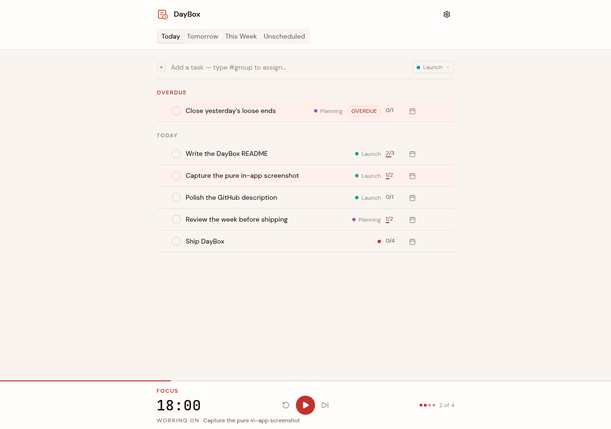

# DayBox

Local-first Pomodoro timer and task planner for shaping today, tomorrow, and the week.



DayBox is a focused planning app for turning loose tasks into a concrete day. It combines a lightweight task planner, group-filtered views, and a Pomodoro timer backed by local-first storage.

## Features

- Plan tasks across Today, Tomorrow, This Week, Later, and Unscheduled views.
- Add, complete, edit, reschedule, delete, and drag-sort tasks within a day.
- Organize work with color-coded groups and filter every planner view by group.
- Track Pomodoro estimates and completed focus sessions per task.
- Focus the timer on a task so each interval has a clear target.
- Tune focus, short break, long break, auto-start, alarm, and notification settings.
- Export/import all app data as JSON, with confirmation before replacing data.
- Keep data local by default, with optional Google Drive backup and restore.
- Switch between light and dark themes and choose the first day of the week.

## Getting Started

```bash
npm install
npm run dev
```

Open the local URL printed by Vite.

## Scripts

- `npm run dev` starts the Vite development server for UI-only HMR.
- `npm run dev:full` starts the full stack via `vercel dev` (SPA + API + OAuth cookies).
- `npm run build` typechecks and builds the production app.
- `npm run typecheck` runs TypeScript checks.
- `npm run lint` runs ESLint.
- `npm run format` formats the codebase with Prettier.
- `npm run test` runs Vitest.
- `npm run preview` previews the production build.

## Google Drive Backup

Drive backup uses a stateless Hono backend on Vercel. The backend performs the OAuth Authorization Code + PKCE exchange and stores an encrypted refresh token in an `HttpOnly` cookie. The SPA never sees the refresh token.

Required environment variables (server-only, never prefixed with `VITE_`):

- `GOOGLE_CLIENT_ID` — OAuth Web Client ID.
- `GOOGLE_CLIENT_SECRET` — OAuth Web Client Secret.
- `TOKEN_ENC_KEY` — 32-byte hex key for AES-256-GCM cookie encryption (generate with `openssl rand -hex 32`).

In Google Cloud Console, add these callback URLs to the Web Client ID's **Authorized redirect URIs**:

- `http://localhost:3000/api/auth/callback` (local `vercel dev`)
- `https://<your-production-domain>/api/auth/callback`
- `https://<project>-<branch>.vercel.app/api/auth/callback` for preview deploys

## Tech Stack

- React 19 and ReactDOM 19
- Vite 8 and TypeScript 6
- Zustand for local state
- Zod for validation
- Tailwind CSS 4 and shadcn UI primitives
- Base UI, lucide-react, motion, and dnd-kit
- Vitest and Testing Library

## Data And Privacy

DayBox is local-first. Tasks, groups, planner settings, timer settings, and theme preference are stored in browser `localStorage` by default. Export/import is available from Settings, and Google Drive backup is optional. When configured, Drive backup writes a visible `daybox.json` file to the root of your Google Drive.
